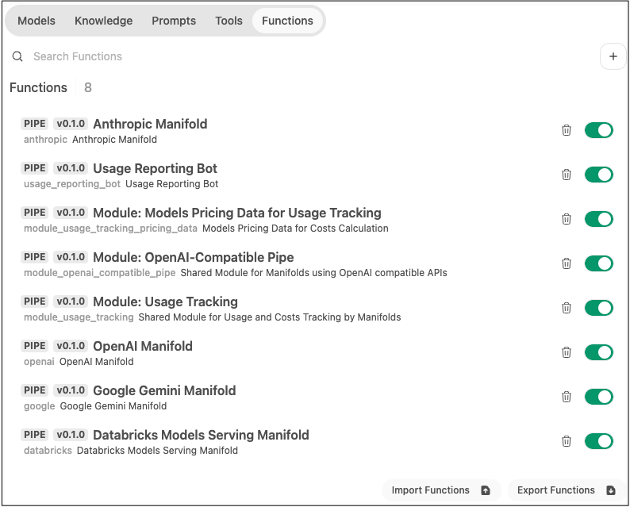

# Cost Tracking Manifold Functions for Open WebUI

## Overview

This repository contains another implementation of manifold functions for OpenAI and Anthropic, with custom usage costs tracking to the main database (SQLite or Postgre), and bot interface for basic reporting.

## Features

- **Batch and Streaming completions** leverages official OpenAI and Anthropic SDKs
- **Usage data logged to DB** new table usage_costs in the main SQLite or Postgres DB
- **Usage tracking works both for UI and API usage** tracking DOES NOT depend on /chat/completed calls
- **Calculates usage costs** pricing data statically defined in a standalone function module, edit it as needed
- **Displays status message** with token counts, estimated costs, request status
- **Built-in reporting on usage costs** with 'Usage Reporting Bot' model pipe. Talk to it via chat

## Requirements

- Python 3.11+
- OpenWebUI v0.3.30+

## Installation

**1. Clone the repo**

**2. (Optional) Activate virtual pyenv**

**3. Create all functions manually one-by-one into Open WebUI Workspace Functions interface**

   Manually create functions in OpenWebUI Workspace UI while providing the correct IDs matching the .py file names in this repository. No need to provide any code, keep it by defailt, it will be overwritten during deployment. Be careful when editing function name as OpenWebUI will try to automatically adjust the ID.
   You need to enter the ID after entering the function name. The function IDs you may want to create:

      - module_openai_compatible_pipe           (mandatory)
      - module_usage_tracking                   (mandatory)
      - module_usage_tracking_util_pricing_data (mandatory)
      - anthropic 
      - openai
      - google
      - databricks
      - usage_reporting_bot

**4. Install dependencies:**
   ```
   pip install -r requirements.txt
   ```

**5. Create `.env` file with the following content:**

   ```python
   #Your OpenWebUI URL, e.g. http://localhost:3000
   OPENWEBUI_API_URL=http:// 

   #Get your API key in OpenWebUI User Settings -> Account -> API Keys
   OPENWEBUI_API_KEY=sk-....  
   ```
   

**6. Deploy functions to OpenWebUI:**

   ```bash
   python deploy_to_openwebui.py src/functions/*
   python deploy_to_openwebui.py src/functions/data/usage_tracking_util_pricing_data.py
   ```

**7. Enable all functions and configure Valves**
   
   Provide API keys where applicable
   
   For OpenAI also provide comma-separated list of enabled models

**8. Expected Result**

